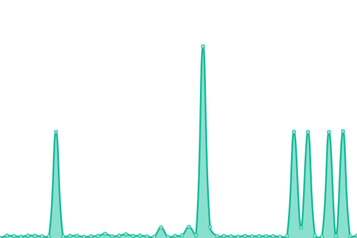
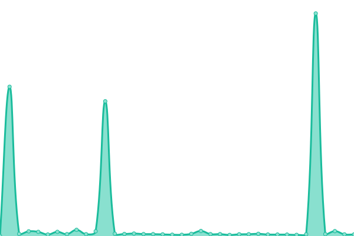
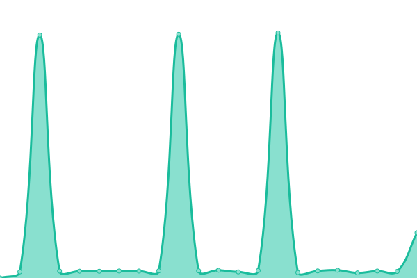

# [📈 Live Status](https://bogotas.github.io/upptime): <!--live status--> **🟥 Complete outage**

This repository contains the open-source uptime monitor and status page for [bogotas](https://bogotas.github.io/upptime), powered by [Upptime](https://github.com/upptime/upptime).

With [Upptime](https://upptime.js.org), you can get your own unlimited and free uptime monitor and status page, powered entirely by a GitHub repository. We use [Issues](https://github.com/bogotas/upptime/issues) as incident reports, [Actions](https://github.com/bogotas/upptime/actions) as uptime monitors, and [Pages](https://bogotas.github.io/upptime) for the status page.

<!--start: status pages-->
<!-- This summary is generated by Upptime (https://github.com/upptime/upptime) -->
<!-- Do not edit this manually, your changes will be overwritten -->
<!-- prettier-ignore -->
| URL | Status | History | Response Time | Uptime |
| --- | ------ | ------- | ------------- | ------ |
|  [Mehbn](https://atugatran-mehbn.onrender.com/db-status) | 🟥 Down | [mehbn.yml](https://github.com/atul22g8570/upptime/commits/HEAD/history/mehbn.yml) | 

 1038ms
     
 | 

<a href="https://atul22g8570.github.io/upptime/history/mehbn">8.19%</a>
    

|  [RestAPI](https://mern-crud-ki1x.onrender.com/db-status) | 🟥 Down | [rest-api.yml](https://github.com/atul22g8570/upptime/commits/HEAD/history/rest-api.yml) | 

 989ms
     
 | 

<a href="https://atul22g8570.github.io/upptime/history/rest-api">8.54%</a>
    

|  [MernCrud](https://mern-crud-ki1x.onrender.com/db-status) | 🟥 Down | [mern-crud.yml](https://github.com/atul22g8570/upptime/commits/HEAD/history/mern-crud.yml) | 

 200ms
     
 | 

<a href="https://atul22g8570.github.io/upptime/history/mern-crud">9.53%</a>
    

|  [MernDashboard](https://merndashboard-v7dv.onrender.com/db-status) | 🟥 Down | [mern-dashboard.yml](https://github.com/atul22g8570/upptime/commits/HEAD/history/mern-dashboard.yml) | 

 246ms
     
 | 

<a href="https://atul22g8570.github.io/upptime/history/mern-dashboard">9.54%</a>
    

<!--end: status pages-->

[**Visit our status website →**](https://bogotas.github.io/upptime)

## 📄 License

- Powered by: [Upptime](https://github.com/upptime/upptime)
- Code: [MIT](./LICENSE) © [Anand Chowdhary](https://anandchowdhary.com), supported by [Pabio](https://pabio.com)
- Data in the `./history` directory: [Open Database License](https://opendatacommons.org/licenses/odbl/1-0/)
